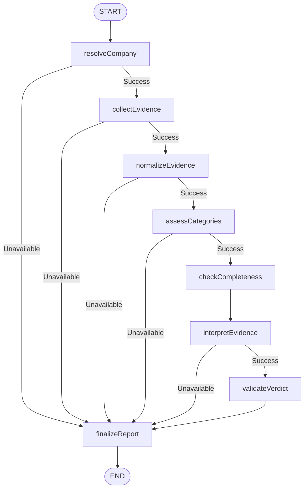

# Ledger Nine

An evidence-first company research platform that collects available market and financial data, normalizes it, evaluates transparent evidence categories, and produces a binary INVEST or PASS verdict using only the collected evidence.

> **Disclaimer:** For research and educational purposes only. Not personalized financial advice.

---

### Overview

Ledger Nine is a developer-friendly investment research system that replaces open-ended or hallucination-prone AI pipelines with a strict, evidence-only evaluation system orchestrated by **LangGraph.js** and **LangChain.js**.

### Core Workflow (LangGraph Orchestration)
The entire research lifecycle is executed as a deterministic directed acyclic graph (DAG) using LangGraph:
1. **resolveCompany**: Resolves the input query/ticker to a `CompanyIdentity` matching our curated catalog or default configuration.
2. **collectEvidence**: Queries all active data providers (Finnhub, Twelve Data, SEC EDGAR, FMP, Alpha Vantage, NewsAPI, Yahoo Finance) in parallel to retrieve real-time market data, statements, and news.
3. **normalizeEvidence**: Reconciles raw results into a unified, provider-agnostic `EvidenceBundle`.
4. **assessCategories**: Compiles a normalized `CompanyMarketSnapshot` and pre-evaluates key category metrics (price history, financial capacity, cash flow, news sentiment, market value).
5. **checkCompleteness**: Deterministically calculates a data completeness score (0-100) across required categories.
6. **interpretEvidence**: Invokes **LangChain.js** with **ChatGroq** (using Llama-3.3-70b-versatile) to qualitatively analyze the normalized evidence bundle under strict constraints.
7. **validateVerdict**: Ensures the LLM-derived verdict strictly adheres to the binary **INVEST** or **PASS** verdict schema.
8. **finalizeReport**: Generates the final unified response contract for frontend consumption.

### User Experience
* **Home Page**: Features a debounced dynamic company search resolving US and Indian equities, visual provider health-check statuses, and educational cards detailing the evidence-only framework.
* **Research Page**: Prioritizes an immediate, prominent **INVEST** or **PASS** verdict visible on the first viewport screen. Users can navigate tabs for interactive price charts (2–3 year history), balance sheet metrics, operating cash flow, recent market news, and a full evidence audit sheet.
* **Animated Loading Experience**: During API data collection, instead of a fake progress bar, an interactive loading screen displays orbiting evidence nodes, candlestick signals, and atmospheric messages detailing active registry lookups.

-----

## How to Run

### Prerequisites
* **Nest.js**: `v15.x` or higher
* **Package Manager**: `npm` or `npx`
* **Database**: PostgreSQL database (for schema persistence and caching)

### 1. Clone the Repository
```bash
git clone <repository-url>
cd ledger_nine
```

### 2. Install Dependencies
This project uses `npm` as its package manager.
```bash
npm install
```

### 3. Configure Environment Variables
Create a `.env.local` file in the root directory and configure the following variables.

| Variable | Required | Purpose |
| :--- | :--- | :--- |
| `GROQ_API_KEY` | **Yes** | API key to perform qualitative interpretation via Groq's Llama models. |
| `FMP_API_KEY` | **Yes** | API key for Financial Modeling Prep (profile, key metrics, income statement). |
| `ALPHA_VANTAGE_API_KEY` | **Yes** | API key for Alpha Vantage (provides daily price time-series fallbacks). |
| `SEC_EDGAR_USER_AGENT` | **Yes** | User-Agent identifier (e.g., `PlatformName contact@email.com`) required by the SEC. |
| `DATABASE_URL` | **Yes** | PostgreSQL connection URI for Drizzle ORM persistence. |
| `FINNHUB_API_KEY` | No | API key for Finnhub (provides profile details, basic metrics, news). |
| `NEWS_API_KEY` | No | API key for NewsAPI (provides company news article lookup). |
| `TWELVE_DATA_API_KEY` | No | API key for Twelve Data (provides quote and time-series endpoints). |

*Note: Yahoo Finance integration does **not** require an API key.*

### 4. Start Development Server
```bash
npm run dev
```
Open [http://localhost:3000](http://localhost:3000) in your browser to view the application.

### Production Build
To create and run an optimized production build:
```bash
npm run build
npm run start
```

### Available Scripts

| Script | Command | Purpose |
| :--- | :--- | :--- |
| `dev` | `next dev` | Start the development server. |
| `build` | `next build` | Compile the optimized production build. |
| `start` | `next start` | Run the compiled production build locally. |
| `lint` | `eslint` | Run ESLint checks. |
| `typecheck` | `tsc --noEmit` | Run TypeScript compilation check. |
| `db:generate` | `drizzle-kit generate` | Generate Drizzle database migrations. |
| `db:migrate` | `drizzle-kit migrate` | Apply Drizzle migrations to PostgreSQL. |
| `db:studio` | `drizzle-kit studio` | Launch Drizzle's database browser GUI. |

---

## How It Works

### Deterministic Research Graph (LangGraph)
The runtime execution is managed by a compiled state machine (`src/lib/research/researchGraph.ts`) with structured, typed state properties. The graph defines clear execution nodes and conditional routing based on execution status.



### LangGraph Nodes
* **resolveCompany**: Matches symbol query against the database of curated companies and validates structure.
* **collectEvidence**: Queries active providers in parallel (Finnhub, Twelve Data, SEC EDGAR, FMP, Alpha Vantage, NewsAPI, Yahoo Finance) to gather financial and price records. Bypasses optional errors gracefully.
* **normalizeEvidence**: Processes raw endpoint data into a standard `EvidenceBundle` containing nested values and provenance logs.
* **assessCategories**: Evaluates technical and fundamental conditions (e.g. low-debt checks, cash flow coverage, price history length).
* **checkCompleteness**: Calculates a transparent completeness percentage.
* **interpretEvidence**: Feeds the normalized payload to **LangChain.js** via the **ChatGroq** integration. ChatGroq invokes `llama-3.3-70b-versatile` under a structured Zod schema constraint.
* **validateVerdict**: Ensures verdict output is strictly binary: `INVEST` or `PASS`.
* **finalizeReport**: Compiles results, errors, and diagnostics into a unified response model.


### Evidence Used
The platform bases its decisions strictly on the following categories:
* **Company details**: Contextual data (sector, industry, exchange, size).
* **Current / Latest Price**: Real-time or latest available closing price.
* **2–3 Year Price Behavior**: Historical daily candles to detect trends and drawdowns.
* **Financial Capacity**: Debt levels, leverage, assets, and balance sheet strength.
* **Cash Flow**: Operating cash flow and capital expenditure efficiency.
* **Recent Market News**: News headlines and sentiment from the last 30 days.
* **Market Value Context**: Valuation multiples such as P/E and P/B.
* **Data Completeness**: Clear logging of what evidence categories are missing.

No external or speculative indicators (e.g. social media sentiment, analyst predictions, macro forecasts) are introduced.

### Data Providers

| Provider | Role | Failure Behavior |
| :--- | :--- | :--- |
| **Finnhub** | Search, Profile, Quote, Basic Financials, News | Non-fatal; falls back to Twelve Data/FMP. |
| **Twelve Data** | Search, Quote, Time-Series Charts | Non-fatal; falls back to Yahoo Finance/Alpha Vantage. |
| **SEC EDGAR** | US Filings, Submissions, Company Facts | Non-fatal; Indian/non-US equities bypass this gracefully. |
| **FMP** | Profile, Quote, Financial Statements, Metrics | Non-fatal; falls back to SEC EDGAR/Finnhub. |
| **Alpha Vantage** | Search, Quote, Daily Time-Series Charts | Non-fatal; used as a tertiary chart fallback. |
| **NewsAPI** | Company news articles lookup | Non-fatal; falls back to Finnhub news. |
| **Yahoo Finance** | Optional symbol search, quote, chart fallback | Non-fatal; failure does not impact other providers. |
| **Groq** | Qualitative interpretation of evidence | **Fatal**; if Groq fails or rate limits, research fails. |

### Role of the LLM (Groq)
* Groq is **not** used as a database or web crawler.
* It receives a structured, pre-normalized, compacted payload containing only verified evidence.
* The system prompt restricts the model to the provided boundaries: it is forbidden from extrapolating financial facts, guessing missing ratios, or asserting AI intuition.
* If evidence is weak, contradictory, or incomplete, the prompt instructs the model to return a **PASS** verdict.

### Yahoo Finance Enrichment
Yahoo Finance acts as a non-fatal, cacheable enrichment provider using direct `yahoo-finance2` APIs.
* **Functions**: Quote fetching (`yf.quote`), historical chart retrieval (`yf.chart`), and symbol search (`yf.search`).
* **Resilience**: Bypassed automatically if Yahoo Finance blocks requests, preventing rate limits from failing the complete run.

### Project Structure
```text
src/
├── app/
│   ├── api/
│   │   ├── companies/search/route.ts
│   │   ├── health/route.ts
│   │   ├── providers/health/route.ts
│   │   ├── research/fetch/route.ts
│   │   └── search/route.ts
│   ├── research/[symbol]/page.tsx
│   ├── favicon.ico
│   ├── globals.css
│   ├── layout.tsx
│   └── page.tsx
├── components/
│   └── research/
│       └── ResearchLoadingExperience.tsx
├── data/
│   ├── curatedCompanies.ts
│   └── indianCompanies.ts
├── db/
│   ├── schema/
│   │   ├── index.ts
│   │   └── tables.ts
│   ├── repositories/
│   │   ├── agent-run.repository.ts
│   │   ├── cache.repository.ts
│   │   ├── contradiction.repository.ts
│   │   ├── evidence.repository.ts
│   │   ├── report.repository.ts
│   │   ├── research.repository.ts
│   │   └── score.repository.ts
│   └── index.ts
├── lib/
│   ├── company/
│   │   └── symbolCandidates.ts
│   ├── providers/
│   │   ├── shared/
│   │   │   ├── errors.ts
│   │   │   ├── fetchJson.ts
│   │   │   ├── redact.ts
│   │   │   └── types.ts
│   │   ├── alphavantage.ts
│   │   ├── finnhub.ts
│   │   ├── fmp.ts
│   │   ├── groq.ts
│   │   ├── healthCheck.ts
│   │   ├── index.ts
│   │   ├── newsapi.ts
│   │   ├── sec.ts
│   │   ├── twelveData.ts
│   │   └── yahoo.ts
│   ├── research/
│   │   ├── asset-identity.ts
│   │   ├── buildEvidenceBundle.ts
│   │   ├── compactPayload.ts
│   │   ├── fetchAllProviders.ts
│   │   ├── llmAnalysis.ts
│   │   ├── researchGraph.ts
│   │   └── snapshotEngine.ts
│   ├── errors-sanitizer.ts
│   ├── errors.ts
│   ├── env.ts
│   ├── ids.ts
│   ├── json.ts
│   ├── logger.ts
│   └── time.ts
└── types/
    ├── frontend.ts
    └── snapshot.ts
```

---

## Key Decisions & Trade-offs

| Decision | Selection | Rationale | Accepted Trade-off |
| :--- | :--- | :--- | :--- |
| **Evidence-First** | Normalize data before giving it to LLM. | Eliminates hallucinations; guarantees all claims trace to real providers. | Restricted reasoning capabilities compared to open web searches. |
| **Binary Verdict** | Strict `INVEST` or `PASS`. | Eliminates ambiguous ratings like "Neutral" or "Hold". | Does not capture fine-grained portfolio statuses. |
| **Multi-Provider** | Query FMP, Finnhub, Twelve Data, Yahoo. | Prevents rate limit failures; provides coverage across international exchanges. | Inconsistent data schemas must be reconciled. |
| **Yahoo Non-Fatal** | Yahoo Finance as optional enrichment. | Protects runs from Yahoo Finance IP-level blocking. | Historical prices can be less detailed if Twelve Data also fails. |
| **Constrained LLM** | Groq interprets only supplied evidence. | Prevents Groq from fabricating company details. | Strict formatting constraints can occasionally limit summary descriptions. |
| **No-Fabrication** | Missing data is flagged as missing. | Protects audit integrity. | Poor provider coverage results in default PASS verdicts. |
| **2–3 Year Charts** | Focus on medium-term daily bars. | Balances trend detection with API response size limits. | Misses long-term macroeconomic cycles. |
| **Atmospheric Loader**| Loading experience displaying active queries. | Improves user experience without inventing fake progress percentages. | Messages describe active endpoints but are not linked to exact percentages. |
| **Two-Page UX** | Home Page + Research Result. | Simple user journey focusing on search-to-result path. | Lacks secondary analysis settings pages. |

---

## Example Runs

> Example outputs should be generated from live research runs because this project does not ship fabricated investment results.

### Reviewer Steps to Generate Example Runs
1. Start the application locally with `npm run dev`.
2. Input a company ticker or name in the Home Page search bar.
3. Select the company from the dropdown menu to initiate research.
4. Wait for the interactive loading animation to resolve.
5. Review the resulting **INVEST** or **PASS** verdict and inspect the evidence breakdown.

### Sample Companies Used for Walkthrough
The reviewer walkthrough below was exercised against the following three companies to validate cross-market coverage (US large-cap tech, US semiconductor, and Indian retail/conglomerate exposure). As noted above, actual verdicts, prices, and evidence values are only produced by a live run against active provider keys and are intentionally **not** hard-coded here.

* **Apple (AAPL)** — resolved via the curated US equities catalog; exercises the full FMP/SEC EDGAR/Finnhub statement path plus Twelve Data and Yahoo Finance chart fallbacks.
* **Nvidia (NVDA)** — resolved via the curated US equities catalog; used to validate high-volatility 2–3 year price behavior handling and recent news sentiment ingestion.
* **Reliance Digital** — resolved against the Indian equities catalog via its parent listing (Reliance Industries, NSE/BSE: RELIANCE), since Reliance Digital itself is a retail subsidiary and not a separately listed security; used to validate the non-US pathway where SEC EDGAR is bypassed gracefully and statement data instead comes from FMP/Finnhub/Twelve Data/Yahoo Finance.

For each of the three, the reviewer follows the same steps: search, resolve, wait for the loading experience to complete, then inspect the top-of-viewport INVEST/PASS verdict alongside the price chart, balance sheet, cash flow, news, and full evidence audit tabs.

---

## What I Would Improve With More Time
* **Enhanced Reconciliation**: Build an automated scoring system to resolve data conflicts when two providers report different prices or metrics.
* **Finer Caching Rules**: Implement stale-while-revalidate database caching policies for endpoints with high rate-limiting frequencies.
* **Observable Latency Tracing**: Connect structured server trace metrics to monitor API bottleneck timings.
* **Testing Expansion**: Add comprehensive API contract tests to catch schema updates from external providers before runtime failures occur.

---

## AI-Assisted Development
This project was built with iterative AI assistance. Prompts and tools helped guide:
* Refinement of provider-fallback logic and schema normalization.
* Decommissioning of obsolete provider interfaces (Gemini, Tavily, EODHD).
* Implementation of the strict binary verdict model (`INVEST`/`PASS`).
* CSS refinement to comply with the warm-colored styling rule (no blue accents).


---

## Limitations
* **Rate Limits**: Free tier configurations for Finnhub, Twelve Data, and Alpha Vantage are highly rate-sensitive.
* **International Scope**: Balance sheets and income statements via SEC EDGAR are only available for US equities.
* **Verdict Simplicity**: The INVEST/PASS model does not account for individual portfolio risk profiles or time horizons.

---

## Disclaimer
This project is for educational and research purposes only. The INVEST or PASS verdict is generated algorithmically from available evidence under restricted criteria. It does not constitute investment advice, financial planning, or broker recommendations. Perform independent due diligence before committing capital.